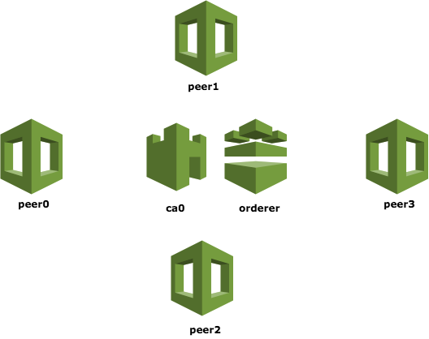
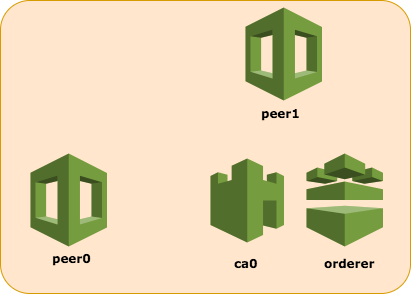
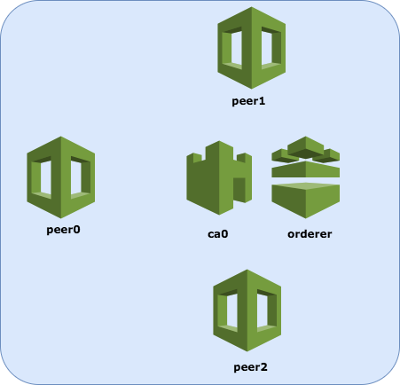
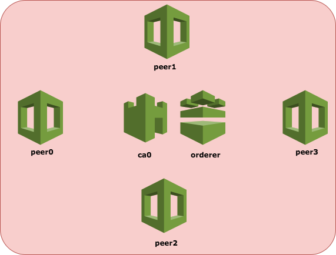
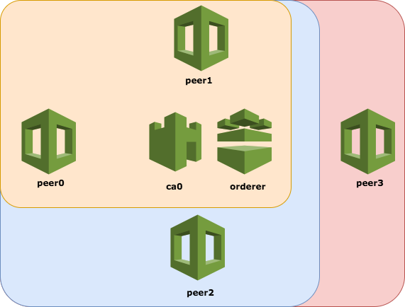

# Fabric _V1 from CLI_  
__Note__: If you got here through a direct link, please read the main [README](../README.md
) first.

Hyperledger Fabric V1 introduces an interesting feature aimed at guaranteeing confidentiality of sensitive data between peers of the same network. The result is obtained not using encryption or obfuscation mechanisms but rather segregating data and keep that information available only to targeted peers in the network. One of the main advantages of this approach is that it does not allow unauthorized peers to store sensitive data in their local ledger. The reason behind this choice is the following: even if encrypted, sensitive data would be still exposed to untrusted (or even worse, malicious) peers which could eventually discover the secret key used in the process or use brute force to finally obtain readable data.

This CLI Demo offers a good example of multi-channel communication between peers.

## Description of the network


The configuration of the network is rather basic and it is the following:

### Organizations
The network is composed of a single organization: `org1.example.com`.

### Members
1.  `ca0` - Certificate Authority for all the members of `org1.example.com`.
2.	`orderer` - The only ordered of the network and having purely a technical function (only ordering). A bigger and scaled network would usually require 2 or more orderers which should first reach consensus based on specific ordering algorithms and then create a new block to deliver to committers.
3.	`peer0` - Having role of unique endorser in the network. It is responsible to sign proposal transactions whether they respect the defined endorsement policy. It is also in charge to perform additional multi-channels operations.
4.	`peer1` - Committing peer.
5.	`peer2` - Committing peer.
6.	`peer3` - Committing peer.

### Channels

**private**



It is one-to-one typology channel between a peer and its endorser. It holds the most sensitive information related to a peer, like balance, ownership on assets, etc.

**trading**



It is created by 2 peers involved in a transaction of transferring ownerships on assets.

**sharing**



It represents the public channel which all the informative but not sensitive is shared in. It includes all the peers of the network.

**Note:** Even if not specified, all the mentioned channels above always include endorsers, ca and orderers.
To define even better the concept of data segregation, each typology of channel is provided with its own customized smart-contract which has also a different datamodel. Note that is not mandatory to use different chaincodes to obtain data segregation.



## Description of the scenario
The presented demo shows a generic lifecycle of an asset: creation, trading and publishing updates.

The scenario can be defined basically in two macro operations: issuing an asset and trading and asset.

### Issuing an asset

1.	Invoke to issue an asset on the `private` channel (peer1)
2.	Invoke to approve an asset on the `private` channel (peer0)
3.	Query to retrieve information about the asset on the `private` channel (peer1)
4.	Other peers not in the `private` channel cannot see the information stored if they try to query it (peer2)
5.	Invoke to create an asset on the `sharing` channel (peer0)

### Trading an asset

1.	Invoke to transfer from John (peer1) to Jane (peer2) on the `trading` channel (peer1)
2.	Query to retrieve the transaction on the `trading` channel (peer2)
3.	Other peers not in the `trading` channel cannot see the information stored if they try to query it (peer3)
4.	Invoke to update the balance of an asset on the `private` channel (peer0)
5.	Invoke to update available quantity of asset on the `sharing` channel (peer0)

## Smart-contracts
### private-cc
```go
type Wallet struct {
	UserID              string   `json:"userID"`
	AccountID           string   `json:"accountID"`
	AssetID             string   `json:"assetID"`
	AssetTitle          string   `json:"assetTitle"`
	AssetIssuedQuantity int64    `json:"assetIssuedQuantity"`
	AssetMyQuantity     int64    `json:"assetMyQuantity"`
	Shareholders        []string `json:"shareholders"`
	Issuer              string   `json:"issuer"`
	Status              string   `json:"status"`
}

const (
	ASSET_ISSUED = "ISSUED"
	ASSET_APPROVED = "APPROVED"
	ASSET_TRADED = "TRADED"
)
```

### trading-cc
```go
type Transaction struct {
	TransactionID   string `json:"transactionID"`
	SellerAccount   string `json:"sellerAccount"`
	ReceiverAccount string `json:"receiverAccount"`
	Amount          int64  `json:"amount"`
	AssetID         string `json:"assetID"`
	AssetTitle      string `json:"assetTitle"`
	Timestamp       int64  `json:"timestamp"`
}
```

### sharing-cc
```go
type Asset struct {
	AssetID                string   `json:"assetID"`
	AssetTitle             string   `json:"assetTitle"`
	AssetAvailableQuantity int64    `json:"assetAvailableQuantity"`
}
```

## Setting up the network
Follow the steps below to start up the network, initialize channels and have a first try of the demo:
1. Run the `install` script
```
./scripts/install.sh
```
It will pull all th docker images needed to execute the demo.
2. Open your terminal, navigate to the root of the project and run the command:
```
docker-compose up -d
```
3.	Wait few seconds and then run in the same tab:
```
docker exec -it cli bash
```
It will run a container in interactive mode that gives us the ability to control the peers. It is configured to hold all the certificates necessary to perform all the operations. Using a certificate of a peer instead of another, it will emulate that specific one. That is the reason why it is important to specify in front of each invoke which peer identity to use.

4.	From the docker container terminal, run the initial configuration script:
```
./scripts/script.sh init
```
It will do the following:
-	Create the 3 channels
-	Peer0 and peer1 join `private` channel
-	Peer0, peer1, peer2 join `trading` channel
-	Peer0, peer1, peer2 and peer3 join `sharing` channel
-	Install `private-cc` chaincode in peer0 and peer1
-	Install `trading-cc` chaincode in peer0, peer1 and peer2
-	Install `sharing-cc` chaincode in peer0, peer1, peer2 and peer3
-	Instantiate all the chaincodes only on peer0

The network is now setup and there will be only containers running the chaincode on peer0. The chaincode containers for peer1 and peer2 will be started as soon as you do a query or invoke on these peers (in lazy-mode).

## Running invokes and queries
From within the `cli` container you can manually run invokes and queries (and other operations listed below).

To run a **query** function with:
```
./scripts/script.sh query [PEER_NR] [CHANNEL] [CHAINCODE] [KEY]
```
e.g.
```
./scripts/script.sh query 0 private private-cc john
```
This will run a query from `peer0` (that means, using its own certificates) on `private` channel, for `private-cc` chaincode of key `john`.

To run a **invoke** function with:
```
./scripts/script.sh invoke [PEER_NR] [CHANNEL] [CHAINCODE] [FUNCTION] [ARGS]
```
e.g. with single composite input
```
./scripts/script.sh invoke 1 private private-cc issueAsset '{"userID":"john","accountID":"A846HD","assetID":"IT123456890","assetTitle":"BigCompany-asset1","assetIssuedQuantity":100,"assetMyQuantity":100,"shareholders":["john"],"issuer":"john","status":"ISSUED"}'
```
This will run an `invoke` from `peer1` on `private` channel, for `private-cc` chaincode, using as parameters the function `issueAsset` and as args a stringified json containing the asset to issue.

Some useful tools could help to:

Create and validate the JSON input (step: 1. Validate, 2. Minify): [JSON Formatter and Validator](https://jsonformatter.org/)

e.g. with multiple inputs
```
./scripts/script.sh invoke 0 private private-cc updateBalance john jane 20
```
This will run an `invoke` from `peer0`, on `private` channel, for `private-cc` chaincode, on an existing asset to `updateBalance` of two existing wallets `john` and `jane`, subtracting the amount `20`.

Here below the complete list of all the commands included in `script.sh`:
```
    init                                                        Run the first initialisation of the network
    demo                                                        Run the interactive demo described in the README
    listFunctions                                               Show a list of the available functions divided by smart-contract
    setPeer [PEER_NR]                                           Set credentials as peer [PEER_NR]
    createChannel [CHANNEL]                                     Create a new channel with [CHANNEL]
    joinChannel [PEER_NR] [CHANNEL]                             Add peer [PEER_NR] to [CHANNEL]
    installChaincode [PEER_NR] [CHAINCODE]                      Install [CHAINCODE] on peer [PEER_NR]
    instantiateChaincode [PEER_NR] [CHANNEL] [CHAINCODE]        Instantiate [CHAINCODE] on peer [PEER_NR] in [CHANNEL] channel
    query [PEER_NR] [CHANNEL] [CHAINCODE] [KEY]                 Query by [KEY] on [CHANNEL] and [CHAINCODE] with [PEER_NR]
    invoke [PEER_NR] [CHANNEL] [CHAINCODE] [FUNCTION] [ARGS]    Invoke [FUNCTION] with [ARGS] on [CHANNEL] and [CHAINCODE] with [PEER_NR]
```
## Clean the containers
The following script will remove all the containers related to Hyperledger Fabric V1, including chaincode containers. Furthermore, it will clean all orphan and incomplete docker images.

Run with:
```
./scripts/clean.sh
```
## Demo step-by-step

**Note:** Each command is preceded by a line of configuration with contains the credentials of each peer executing the specific operation.

If you do not want to copy-and-paste command by command into the terminal, there is an easy and interactive way to run this demo with one single command:
```
./scripts/script.sh demo
```

### Issuing an asset
Invoke to issue an asset on the `private` channel (peer1):
```
./scripts/script.sh invoke 1 private private-cc issueAsset '{"userID":"john","accountID":"A846HD","assetID":"IT123456890","assetTitle":"BigCompany-asset1","assetIssuedQuantity":100,"assetMyQuantity":100,"shareholders":["john"],"issuer":"john","status":"ISSUED"}'
```
Invoke to approve an asset on the `private` channel (peer0):
```
./scripts/script.sh invoke 0 private private-cc approveAsset john
```
Query to retrieve information about the asset on the `private` channel (peer1):
```
./scripts/script.sh query 1 private private-cc john
```
Other peers not in the `private` channel cannot see the information stored if they try to query it (peer2):
```
./scripts/script.sh query 2 private private-cc john
```
Invoke to create an asset on the `sharing` channel (peer0):
```
./scripts/script.sh invoke 0 sharing sharing-cc createAsset '{"assetID":"IT123456890","assetTitle":"BigCompany-asset1","assetAvailableQuantity":100}'
```

### Trading an asset
Invoke to transfer from John (peer1) to Jane (peer2) on the `trading` channel (peer1):
```
./scripts/script.sh invoke 1 trading trading-cc transfer '{"transactionID":"transaction1","sellerAccount":"john","receiverAccount":"jane","amount":20,"assetID":"IT123456890","assetTitle":"BigCompany-asset1","timestamp":1491387927548}'

```
Query to retrieve the transaction on the `trading` channel (peer2):
```
./scripts/script.sh query 2 trading trading-cc transaction1
```
Other peers not in the `trading` channel cannot see the information stored if they try to query it (peer3):
```
./scripts/script.sh query 3 trading trading-cc transaction1
```
Invoke to update the balance of an asset on the `private` channel (peer0):
```
./scripts/script.sh invoke 0 private private-cc updateBalance john jane 20
```
Note: Take in account that, a symmetrical operation to create/update the balance on the `private` channel between peer0 and peer2 should be done as well, but it is not included in this demonstration (channel missing).

Invoke to update available quantity of asset on the `sharing` channel (peer0):
```
./scripts/script.sh invoke 0 sharing sharing-cc updateAsset IT123456890 20
```

### Get all the assets
Query to retrieve all the assets on the `sharing` channel (peer3):
```
./scripts/script.sh invoke 3 sharing sharing-cc getAllAssets available
```

## Troubleshooting
- Do NOT use the docker detachment mode (`-d`) together with `--force recreate`. So go only for `docker-compose up -d` and use the `./scripts/clean.sh` to clean your environment.
- If you see './scripts/script.sh: line 219: peer: command not found' this probably means you're running the script from outside of the container. First run `docker exec -it cli bash` and start the script from in there.
- While running `./scripts/script.sh init` inside the `cli` container you get `Error endorsing chaincode: rpc error: code = Unknown desc = Error starting container: API error (404): {"message":"network assetlifecycle_default not found"}` and your `dev-` container stopped. More likely is due to a wrong configuration if the `CORE_VM_DOCKER_HOSTCONFIG_NETWORKMODE` variable. Go to `network/base/peer-base.yaml` and be sure to have `- CORE_VM_DOCKER_HOSTCONFIG_NETWORKMODE=ROOTFOLDER_default`, where `ROOTFOLDER` is the name of your main directory, e.g. `asset-lifecycle` in case you cloned directly with git.
